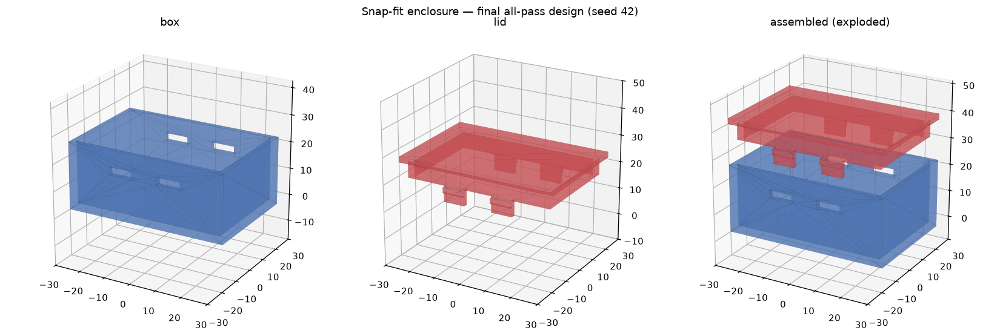

This notebook is reproducible from `config.yaml` + `src/enclosure.py`.
It rebuilds the converged design, re-runs every gate, and reproduces the
final-design 3-view. The full revise-loop trace lives in `log.md`; the
canonical numbers live in `metrics.json`.

```{python}
#| label: setup
import sys, json
from pathlib import Path
import yaml

HERE = Path.cwd()
sys.path.insert(0, str(HERE / "src"))
from enclosure import build  # noqa: E402
from run import cantilever_peak_strain, check_gates, START_PARAMS  # noqa: E402

cfg = yaml.safe_load((HERE / "config.yaml").read_text())
params = cfg["params"]; material = cfg["material"]; gates = cfg["gates"]
params
```

## Build the converged design and run all gates

```{python}
#| label: gates
box, lid, diag = build(params)
all_pass, checks, numbers, failures = check_gates(params, diag, material, gates)
print("all gates pass:", all_pass)
print("failures:", failures)
numbers
```

## Strength gate (closed-form cantilever)

CalculiX / FreeCAD / gmsh are absent on this host, so the snap-arm
strength gate uses the proposal-permitted beam screen
$\varepsilon_{max} = \dfrac{3\,t_{arm}\,\delta}{2\,L_{arm}^2}$, where
$\delta$ is the hook engagement depth (tip deflection at full insertion).

```{python}
#| label: strength
eps = cantilever_peak_strain(
    params["snap_arm_thickness"], params["snap_hook_depth"],
    params["snap_arm_length"],
)
margin = material["yield_strain"] / eps
print(f"peak strain   = {eps:.5f}")
print(f"yield strain  = {material['yield_strain']}  (PETG)")
print(f"safety margin = {margin:.2f}  (gate requires >= {gates['strain_margin_min']})")
```

## The verify-revise loop

The starting (defective) parameter set and the number of cycles to
convergence are recorded in `metrics.json`; the per-cycle failures->fixes
are in `log.md`.

```{python}
#| label: loop-summary
m = json.loads((HERE / "metrics.json").read_text())
print("start params (deliberately defective):")
for k in ("wall_t", "clearance", "snap_arm_length", "snap_arm_thickness",
          "snap_lead_in_deg"):
    print(f"  {k}: {START_PARAMS[k]}  ->  {params[k]}")
print()
print("cycles to first all-pass:", m["cycles_to_first_all_pass"],
      f"(budget {m['max_revise_cycles_budget']})")
print("failure taxonomy:", m["process"]["failure_taxonomy"])
```

## Final design — 3-view



STEP/STL exports for both parts and the closed/exploded assembly are in
`results/`.
